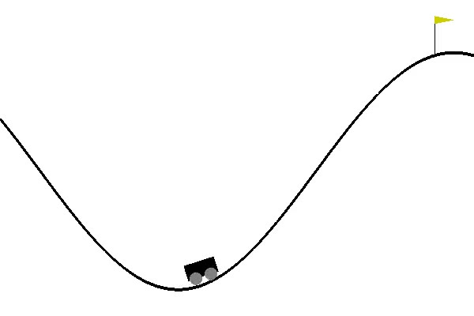

# Open AI
This project use deep learning to achieve goals in games.
```
'''
• ENTRADAS AMBIENTE
	             	Min	    Max
0	posicao        -1.2	    0.6
1	velocidade     -0.07        0.07

• ENTRADA AGENTE
0	aperta esquerda
1	nao faz nada
2	aperta direita

• RECOMPENSA
(-1) para cada frame, até o objetivo da posição 0.5 ser alcançada.
'''

```


